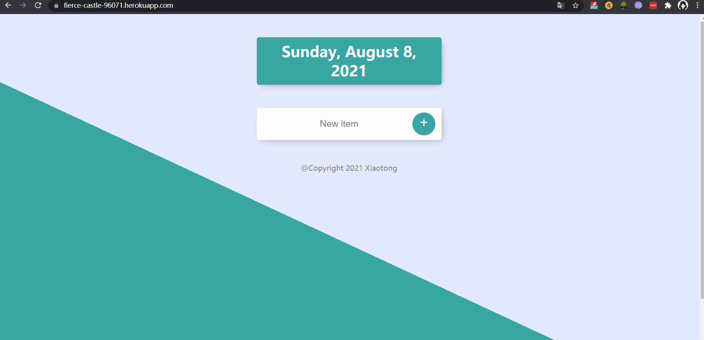

# Mongoose_todoList_App  

## Check Out the APP: [To-Do-List App](https://fierce-castle-96071.herokuapp.com/work)  

### The Express and Mongoose Deployed To-Do-List Web APP is consisted of three parts, the home page, the about page and the customized task List page. User first access the homepage where shows the date and tasks could be set by clicking the "+" sign. Also, the customized task lists can be accessed through input params such as "chores" or "work" into url path, every single type in will generate the relative customized task list. 

## SKILLS:
#### It covers the topic of **_HTML, CSS,Js, Node.js, Express, MongoDB, Mongoose and Heroku**  

## HOW DOES IT WORK:
#### The project is deployed by Node.js and hosted on Heroku. The todoList app uses mongo Atlas as the database to store the input data.   The repo contains the backend file: app. js as the server file.    

## Display: 

